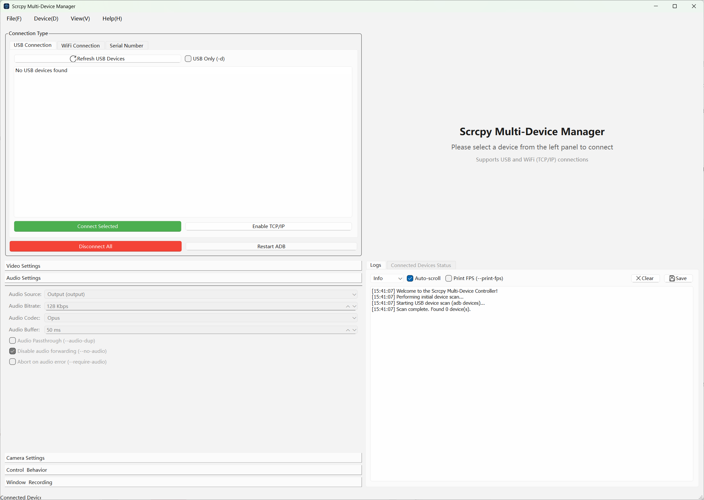

# Scrcpy Desktop - A Multi-Device Scrcpy Desktop Client

**English | [中文](./README.zh-CN.md)**

  

**Scrcpy Desktop** is a powerful desktop GUI client built on top of [scrcpy](https://github.com/Genymobile/scrcpy). Developed using C++ and the Qt framework, it aims to provide an intuitive and efficient way to manage and control multiple Android devices simultaneously.

This project is an independent graphical client. Its core mirroring and control functionalities rely entirely on the excellent open-source project [**scrcpy**](https://github.com/Genymobile/scrcpy), developed by [Genymobile](https://www.genymobile.com/). We extend our sincere gratitude to the Genymobile team for creating such a remarkable and high-performance tool!

## 📑 Table of Contents

- [✨ Key Features](#-key-features)
- [📦 Installation & Dependencies](#-installation--dependencies)
  - [Download Pre-compiled Version (Recommended)](#download-pre-compiled-version-recommended)
  - [Build from Source](#build-from-source)
    - [1. Dependencies](#1-dependencies)
    - [2. Scrcpy-Server](#2-scrcpy-server)
    - [3. Compilation Steps](#3-compilation-steps)
- [🚀 How to Use](#-how-to-use)
- [🏗️ Project Architecture](#️-project-architecture)
- [📄 License](#-license)
- [🙏 Acknowledgements](#-acknowledgements)

## ✨ Key Features

- **Multi-device Management**: View and manage all connected devices (via USB or Wi-Fi) in a single interface.
- **High-Performance Mirroring**: Utilizes FFmpeg for hardware-accelerated decoding, providing low-latency, high-framerate screen mirroring.
- **Real-time Device Control**: Seamlessly control your device with a mouse and keyboard, supporting clicks, scrolling, text input, and more.
- **Rich Configuration Options**: A graphical interface to easily configure all of scrcpy's parameters without memorizing complex command-line arguments.
  - **Video**: Resolution, bitrate, frame rate, video source (screen/camera), encoders (H.264/H.265/AV1).
  - **Audio**: Audio forwarding (requires Android 11+), audio source, bitrate, encoders.
  - **Control**: Show touches, stay awake, turn screen off on close, etc.
  - **Recording**: One-click screen recording to MP4 or MKV files.
- **Device Action Toolbar**: A convenient toolbar in each device window for common actions (Power, Volume, Rotate, Home, Back, Screenshot, etc.).
- **Wireless Connection Helper**: Simplifies the process of connecting devices over Wi-Fi, including a one-click button to enable TCP/IP mode.
- **Status Monitoring**: Real-time monitoring of connected device states (resolution, connection type, etc.) in a table view.
- **Cross-Platform Support**: Compiles and runs on Windows, macOS, and Linux.
- **Configuration Profiles**: Save and load your preferred settings to quickly switch between different scenarios.

## 📦 Installation & Dependencies

### Download Pre-compiled Version (Recommended)

For most users, we recommend downloading the latest version for your operating system directly from the **[Releases](https://github.com/5Mr-Liu/scrcpyDesktop/releases)** page.

### Build from Source

If you wish to compile the project yourself, please ensure the following dependencies are correctly installed and configured.

#### 1. Dependencies

- **ADB (Android Debug Bridge)**: Must be installed and its path added to the system's `PATH` environment variable.
  - Download from [Android SDK Platform Tools](https://developer.android.com/studio/releases/platform-tools).
  - Verify installation by running `adb --version` in your terminal or command prompt.
- **Qt Framework (6.x or newer)**: This project is developed with Qt.
  - Download the [Qt Online Installer](https://www.qt.io/download-qt-installer).
  - During installation, make sure to select a Qt version that matches your compiler (e.g., MinGW or MSVC on Windows, Clang on macOS, GCC on Linux).
- **FFmpeg Libraries (dev/shared)**: Required for decoding the video stream from scrcpy.
    - **Windows**: Download the `full_build-shared.7z` version from [FFmpeg for Windows](https://www.gyan.dev/ffmpeg/builds/). Copy the contents of the `include` and `lib` directories to your project or compiler's path, and copy the `.dll` files (e.g., `avcodec-*.dll`, `avutil-*.dll`) from the `bin` directory to the same directory as the final executable (`.exe`).
    - **macOS**: Install with Homebrew: `brew install ffmpeg`
    - **Linux (Ubuntu/Debian)**: Install with apt: `sudo apt-get install libavcodec-dev libavformat-dev libswscale-dev libavutil-dev`

#### 2. Scrcpy-Server

This project requires the `scrcpy-server` file to run the service on the Android device.
1.  Go to the [Scrcpy Releases](https://github.com/Genymobile/scrcpy/releases) page.
2.  Download a compatible `scrcpy-server` file (e.g., **v2.4**).
3.  **Rename** the downloaded file to `scrcpy-server` and place it **next to the application's final executable**.

#### 3. Compilation Steps

##### Using Qt Creator (Recommended)

1.  Clone the repository: `git clone https://github.com/5Mr-Liu/scrcpyDesktop.git`
2.  Open the `.pro` file in the project's root directory with Qt Creator.
3.  Configure the project to use your installed Qt Kit.
4.  Click the "Build" button, then the "Run" button.

**Note**: Before running, ensure the `scrcpy-server` file and FFmpeg `.dll` files (Windows only) are placed next to the executable.

## 🚀 How to Use

1.  **Launch the Application**: Run the compiled executable.
2.  **Connect a Device**:
    -   **USB Connection**:
        1.  Enable "Developer options" and "USB debugging" on your Android device.
        2.  Connect the device to your computer via a USB cable.
        3.  Click "Refresh USB Devices" in the left panel of the application.
        4.  Your device should appear in the list with the status `device`. If it shows `unauthorized`, check your device's screen to grant USB debugging permissions.
        5.  Select your device and click the "Connect USB Device" button.
    -   **Wi-Fi Connection (Wireless)**:
        1.  First, connect the device via USB.
        2.  Select the device in the "USB Devices" list and click "Enable TCP/IP Mode".
        3.  Disconnect the USB cable.
        4.  Find your device's IP address in Settings -> About Phone -> Status.
        5.  Enter the IP address in the "Wi-Fi Connection" tab in the application and click "Connect via Wi-Fi".
3.  **Configure Options**:
    -   **Before** connecting to a device, you can set all parameters in the "Scrcpy Parameter Configuration" panel on the right.
    -   Expand sections like "Video Settings" and "Audio Settings" to adjust options as needed.
4.  **Device Window**:
    -   Upon successful connection, a new window will open, displaying your device's screen in real-time.
    -   Use your mouse to click, drag, and scroll to simulate touch gestures.
    -   Use your computer's keyboard for text input.
    -   Use the toolbar at the top of the window for quick actions (Home, Back, Lock Screen, etc.).
5.  **Save/Load Configuration**:
    -   From the "File" menu, you can save your current parameter setup to an `.ini` file.
    -   Later, you can quickly restore these settings by using "Load Configuration".

## 🏗️ Project Architecture

This project uses a modular design to separate different functionalities into distinct classes, improving code readability and maintainability.

-   `MainWindow`: The main application window, responsible for managing the overall UI, user interactions, and initiating device connections.
-   `DeviceManager`: Asynchronously discovers and updates the list of connected devices using the `adb devices` command.
-   `DeviceWindow`: The core of each device connection. It manages the entire lifecycle of a single device, including pushing the server, establishing connections, displaying video, and handling user input.
-   `AdbProcess`: A wrapper class for `QProcess` that simplifies executing `adb` commands.
-   `ScrcpyOptions`: A data structure class that collects all configurations from the UI and generates the command-line arguments needed to start the scrcpy-server.
-   `VideoDecoderThread`: A dedicated `QThread` that uses the FFmpeg library to efficiently decode the video stream received from the device, ensuring a smooth UI.
-   `ControlSender`: Responsible for serializing mouse and keyboard input events into the scrcpy control protocol format and sending them to the device over a separate TCP socket.
-   `UiStateManager`: Manages the interactive logic between UI controls in the main window (e.g., disabling all video-related options when "Disable Video" is checked).

## 📄 License

This project is licensed under the [MIT License](LICENSE). See the `LICENSE` file for details.

## 🙏 Acknowledgements

-   **[scrcpy](https://github.com/Genymobile/scrcpy)**: The core technology that makes this project possible. Thank you to the Genymobile team for their outstanding work.
-   **[Qt Framework](https://www.qt.io/)**: For providing a powerful cross-platform GUI development toolkit.
-   **[FFmpeg](https://ffmpeg.org/)**: For its unparalleled audio/video processing capabilities.
-   **All Contributors and Users**: Thank you for your support and feedback!
